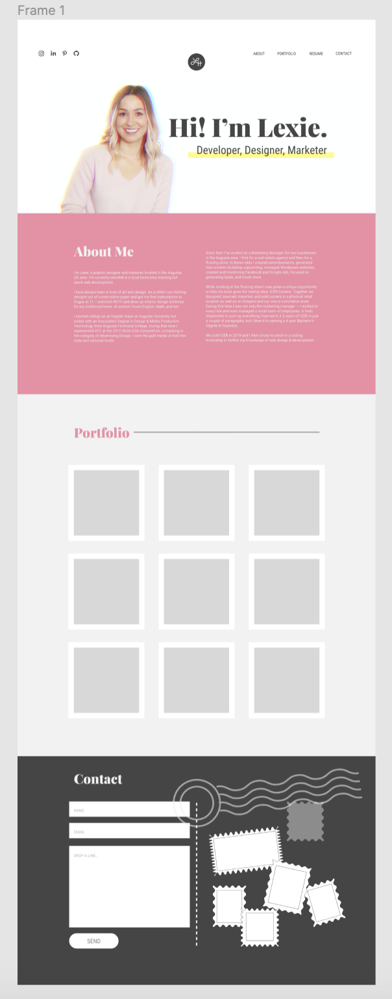
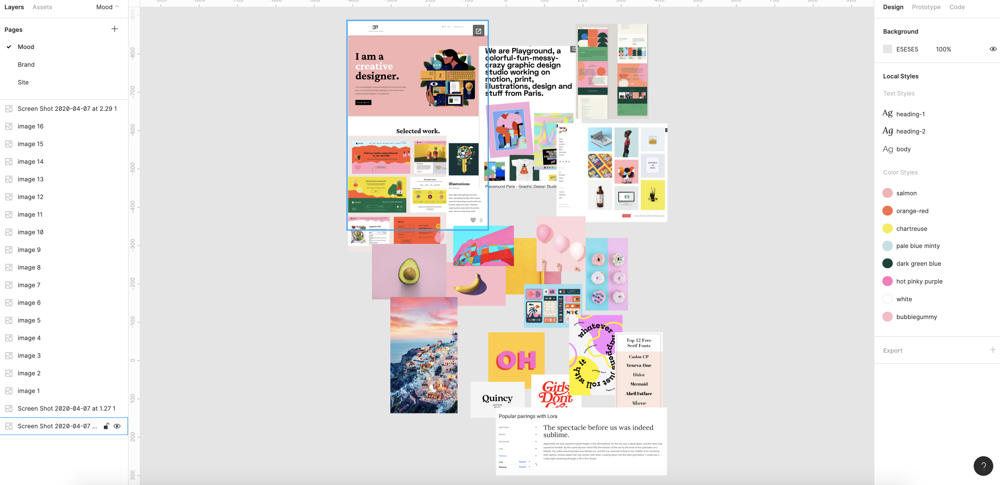
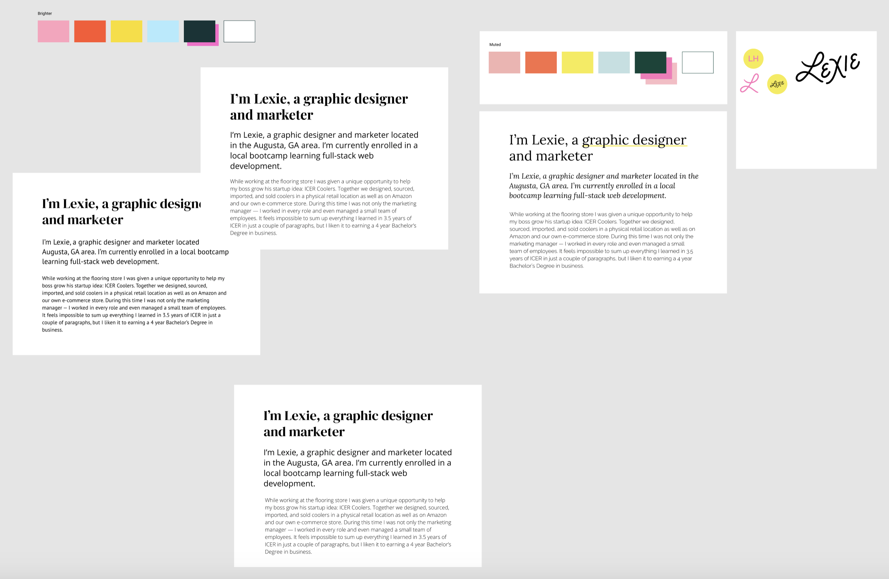
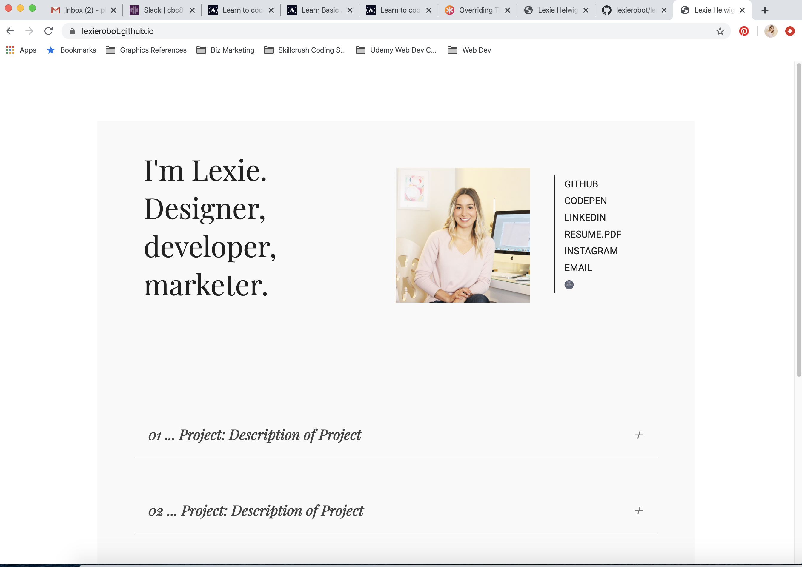
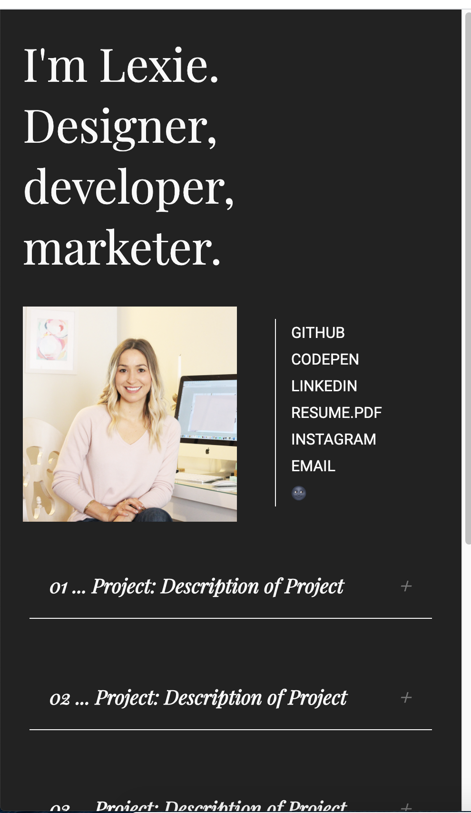

# lexierobot.github.io
## Personal Portfolio Website
- Built over the course of coding bootcamp (12 weeks)
___

## First Design Draft - Feb 9-16
- decided on a color palette in Adobe colors
- played around with designs in Figma
- wanted to make sure it was mobile responsive right away
- played with Bootstrap to build navbar & layout

### Figma Mockup:

___

## Second Design Draft
- colorblock 1 page scroll
- After weeks of sitting on this, I was no longer loving my color palette or layout ideas, and was finding Bootstrap irritating.
- I went back to the drawing board in Figma and created another design

### Figma Mockup:

___

## Third Design Draft
- colorful, multi-page design
- wanted to do a pinterest style masonry layout for portfolio projects
- built with CSS Grid, found out masonry would require some javascript
- looked at some plugin type solutions for masonry layout, but I was feeling commited to hand coding everything.

### Moodboard in Figma:
- turned to Pinterest, dribbble, awwwards for inspiration

### Figma Mockups: 
 

### Screenshots:

___

## Fourth & Final Design
- scrapped it all! the colors were too much. Masonry grid problem was feeling less important than having it done.
- single page, simple (magazine-like) layout
- incorporate a dark mode option w javascript
- incorporate accordion portfolio w javascript
- mobile responsive

### Figma Mockup:

### Screenshots:

